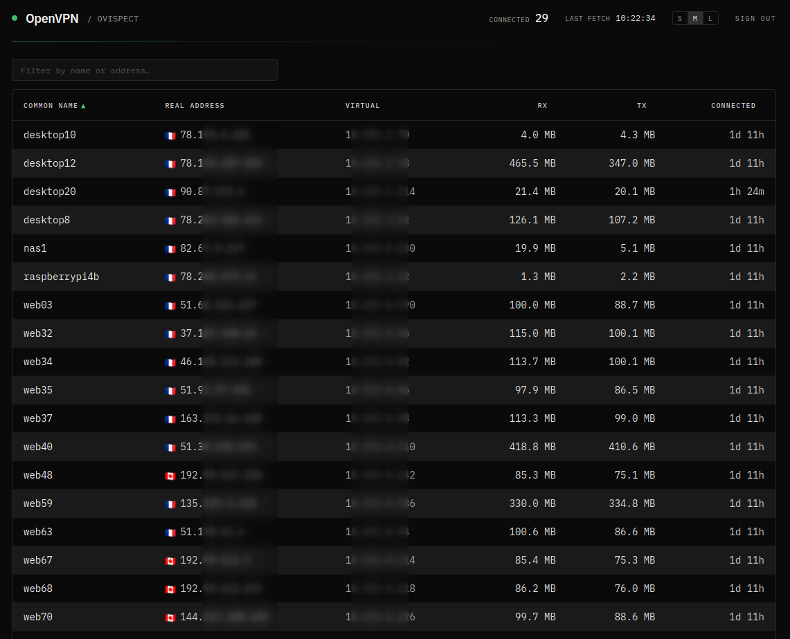

# ovispect

[](https://github.com/Upellift99/ovispect/actions/workflows/ci.yml)
[](LICENSE)
[](https://www.python.org/)
[](https://github.com/Upellift99/ovispect/pkgs/container/ovispect)

A lightweight, modern dashboard for OpenVPN's management interface. ovispect
gives you an at-a-glance view of who is connected to your OpenVPN server, with
a refined dark UI that fits well into a bookmark bar — not a long-term
monitoring suite.



## Features

- Single binary container, ≤ 75 MB, runs as non-root
- Reads OpenVPN's `status 3` (TSV) over the management interface — no log scraping
- Modern dashboard: sortable columns, live search, totals row, click-to-drawer
  per-client details, IP-to-country flag in the table, and live diff
  highlight when clients connect/disconnect
- Optional Prometheus exposition (`/metrics`) for ad-hoc scraping
- 12-factor configuration via environment variables only
- Strict types (`mypy --strict`), linted with `ruff`, container linted with `hadolint`
- Built for Linux `amd64` and `arm64`

## Why ovispect?

| Project                          | Image  | Maintained | UI            | GeoIP | Auth |
|----------------------------------|--------|------------|---------------|-------|------|
| `ruimarinho/openvpn-monitor`     | 927 MB | no         | dated         | yes   | no   |
| `samuelkadolph/openvpn-monitor`  | 58 MB  | yes        | same as above | yes   | no   |
| `kumina/openvpn_exporter` (Prom) | ~15 MB | yes        | none          | no    | no   |
| **ovispect** (this project)      | ≤75 MB | yes        | modern        | yes   | yes  |

ovispect targets the *"I bookmarked this, I want a quick clean look"* use
case. For long-term monitoring, alerting, and historical graphs, pair it with
Prometheus + Grafana or Zabbix — those tools do that job better and ovispect
will not try to compete with them.

## Quick start

```bash
docker run -d \
    --name ovispect \
    -e OPENVPN_HOST=10.0.0.5 \
    -e OPENVPN_PORT=5555 \
    -p 8000:8000 \
    ghcr.io/upellift99/ovispect:latest
```

Then open <http://localhost:8000>.

A drop-in `compose.example.yml` is provided in this repo.

## Configuration

| Variable                      | Default     | Description                                                                 |
|-------------------------------|-------------|-----------------------------------------------------------------------------|
| `OPENVPN_HOST`                | (required)  | Hostname or IP of the OpenVPN management interface                          |
| `OPENVPN_PORT`                | (required)  | TCP port of the management interface                                        |
| `OPENVPN_PASSWORD`            | (empty)     | Management password if `management-client-auth` is configured server-side   |
| `SITE_NAME`                   | `OpenVPN`   | Name shown in the dashboard header                                          |
| `REFRESH_SECONDS`             | `10`        | Auto-refresh interval (1–3600)                                              |
| `TIMEZONE`                    | `UTC`       | IANA timezone for displayed timestamps (e.g. `Europe/Paris`)                |
| `LOG_LEVEL`                   | `INFO`      | `DEBUG`, `INFO`, `WARNING`, `ERROR`, or `CRITICAL`                          |
| `BIND_HOST`                   | `0.0.0.0`   | Address the HTTP server listens on inside the container                     |
| `BIND_PORT`                   | `8000`      | Port the HTTP server listens on inside the container                        |
| `MANAGEMENT_TIMEOUT_SECONDS`  | `5.0`       | Socket timeout when talking to the management interface                     |

## OpenVPN management interface setup

ovispect reads from OpenVPN's text-based management interface. Add the
following to your `server.conf` (or equivalent), then reload OpenVPN:

```conf
# Listen on a private interface only — never expose this to the public internet.
management 10.0.0.5 5555
```

If you want to require a password, point the directive at a file containing
the secret on its first line:

```conf
management 10.0.0.5 5555 /etc/openvpn/management.pass
```

```bash
# Generate a random password file readable only by openvpn:
openssl rand -base64 32 > /etc/openvpn/management.pass
chmod 600 /etc/openvpn/management.pass
```

Then set `OPENVPN_PASSWORD` in ovispect to the same value.

## Authentication

ovispect supports two deployment modes; pick whichever fits your stack.

### Mode 1 — Built-in authentication (standalone)

Generate a bcrypt hash:

```bash
python -m ovispect.hash_password
# or, once installed:
ovispect-hash-password
```

If you do not have ovispect installed locally, the equivalent one-liner with
`apache2-utils` is:

```bash
htpasswd -nbB admin "yourpassword" | cut -d: -f2
```

Set the env vars:

```env
AUTH_USERNAME=admin
AUTH_PASSWORD_HASH=$2b$12$........................................................
SESSION_SECRET=$(openssl rand -hex 32)
```

That's it — visit `/`, you'll be redirected to a login form. Successful
sign-ins set a `SameSite=Strict` session cookie that lasts
`SESSION_LIFETIME_SECONDS` (24h by default). `/healthz` stays public for
container health checks.

A failed-login rate limit applies (5 failures per IP per 5 minutes, then a
5-minute lockout). It is process-local; for fleet-wide protection put a WAF
or fail2ban in front.

> **Run ovispect behind HTTPS in standalone mode.** `SESSION_COOKIE_SECURE`
> is `true` by default — only flip it to `false` for local plaintext
> testing. For production, terminate TLS with Caddy, Traefik (Let's
> Encrypt), or any other reverse proxy.

### Mode 2 — Reverse proxy (multi-user, SSO, etc.)

Leave `AUTH_PASSWORD_HASH` empty or unset. ovispect will not enforce any
authentication and the request reaching it is trusted. Common front-ends:

- nginx + basic auth
- oauth2-proxy + your favorite IdP (Keycloak, Authelia, etc.)
- Caddy with `basicauth` or `forward_auth`
- Traefik forward-auth middleware
- BunkerWeb with auth plugins

Whichever you pick, never expose ovispect (or the OpenVPN management
interface) directly to the public internet.

### Auth-related environment variables

| Variable                   | Default              | Notes                                                        |
|----------------------------|----------------------|--------------------------------------------------------------|
| `AUTH_USERNAME`            | `admin`              | Username expected at sign-in                                 |
| `AUTH_PASSWORD_HASH`       | (empty)              | Bcrypt hash. **Empty disables built-in auth.**               |
| `SESSION_SECRET`           | (empty)              | ≥ 32 chars. Required iff `AUTH_PASSWORD_HASH` is set.        |
| `SESSION_LIFETIME_SECONDS` | `86400`              | Session cookie max-age (60 to 30 days)                       |
| `SESSION_COOKIE_NAME`      | `ovispect_session`   | Cookie name                                                  |
| `SESSION_COOKIE_SECURE`    | `true`               | `Secure` flag. Disable only for local plaintext testing.     |

## Migration from `openvpn-monitor`

If you currently run `ruimarinho/openvpn-monitor`, the swap is almost a
one-liner. Before:

```yaml
services:
  monitor:
    image: ruimarinho/openvpn-monitor
    environment:
      OPENVPNMONITOR_DEFAULT_HOST: 10.0.0.5
      OPENVPNMONITOR_DEFAULT_PORT: 5555
    ports: ["80:80"]
```

After:

```yaml
services:
  ovispect:
    image: ghcr.io/upellift99/ovispect:latest
    environment:
      OPENVPN_HOST: 10.0.0.5
      OPENVPN_PORT: 5555
      SITE_NAME: My VPN
    ports: ["8000:8000"]
```

### IP-to-country lookup

A flag and ISO country code are shown next to each client's real address
when the bundled DB-IP.com Lite database resolves the IP. The dashboard
silently falls back to no flag when the address is private/loopback or
when the database is unavailable. See the *License → Third-party data
attributions* section for details on opting out.

## Building from source

With `uv` (recommended):

```bash
uv venv && source .venv/bin/activate
uv pip install -e ".[dev]"
pytest
```

With `venv` + `pip`:

```bash
python3 -m venv .venv && source .venv/bin/activate
pip install -e ".[dev]"
pytest
```

Build the container locally:

```bash
docker build -t ovispect:dev .
docker run --rm -e OPENVPN_HOST=10.0.0.5 -e OPENVPN_PORT=5555 -p 8000:8000 ovispect:dev
```

## Contributing

See [CONTRIBUTING.md](CONTRIBUTING.md). Bug reports and feature requests are
welcome via [GitHub Issues](https://github.com/Upellift99/ovispect/issues).

## Security

To report a vulnerability, please follow the procedure in
[SECURITY.md](SECURITY.md). Do not open a public issue for security reports.

## License

MIT — see [LICENSE](LICENSE).

ovispect is independent from, and not affiliated with, OpenVPN Inc.
The terminal-style design and feature scope took moral inspiration from
[`furlongm/openvpn-monitor`](https://github.com/furlongm/openvpn-monitor); no
code was copied.

### Third-party data attributions

- IP-to-country lookup data is provided by [DB-IP.com](https://db-ip.com)
  ([IP to Country Lite](https://db-ip.com/db/download/ip-to-country-lite)),
  distributed under [CC-BY-4.0](https://creativecommons.org/licenses/by/4.0/).
  The database is bundled in the Docker image and refreshed on every
  release build. To opt out (offline / air-gapped builds, or simply to
  disable the country column), build with `--build-arg SKIP_GEOIP=1` or
  unset `GEOIP_DATABASE_PATH` at runtime.
